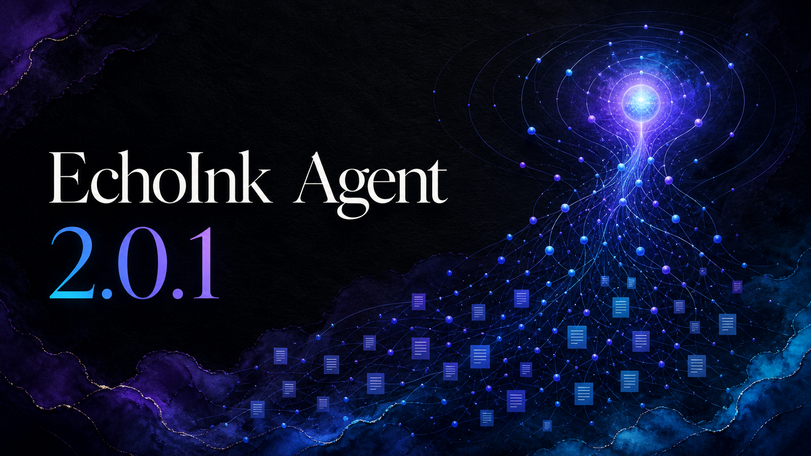

<p align="center">
  <a href="https://github.com/AKin-lvyifang/codex-echoink/releases/latest">
    
  </a>
</p>

<h1 align="center">EchoInk Agent</h1>

<p align="center">Manage your Obsidian knowledge while your personal agent grows to understand you better.</p>

<p align="center">
  <a href="#features">Features</a> ·
  <a href="#installation">Installation</a> ·
  <a href="#quick-start">Quick Start</a> ·
  <a href="#knowledge-maintenance">Knowledge Maintenance</a> ·
  <a href="#review-and-memory-correction">Review and Memory</a> ·
  <a href="#privacy-and-data">Privacy</a> ·
  <a href="README_CN.md">中文</a>
</p>

<p align="center">
  <a href="https://github.com/AKin-lvyifang/codex-echoink/releases/latest">
    
    
    
  </a>
</p>

<p align="center">
  <a href="https://github.com/AKin-lvyifang/codex-echoink/releases/tag/2.0.2"><strong>Download 2.0.2</strong></a>
</p>

EchoInk Agent is a personal knowledge agent for Obsidian. It keeps conversations going, organizes and maintains your vault, and turns useful context into visible, correctable long-term memory. As you use it, that memory helps the agent learn what you care about, how you make decisions, and what you are working on, so it becomes a more useful personal agent over time. No Codex CLI installation is required: add the API URL, API key, and model for OpenAI or a compatible provider to get started.

## What changed in 2.0

- The conversation runtime now uses one Pi-native AgentSession path for history, tools, and follow-up turns.
- Long-term memory is organized into facts, views, decisions, active items, and episodes. Corrections are generated as previews and written only after explicit confirmation.
- `/maintain` supports global maintenance, one attached Raw note, and fuzzy note-name targeting. It ends without duplicate writes when nothing needs updating.
- Review now combines report generation and destination settings, with entry points for archived conversations and memory correction.
- Provider setup stores API keys directly and no longer requires a separate Credential setup step.
- The conversation header, message actions, composer toolbar, and send button were rebuilt. Low-value Agent status and knowledge-health widgets were removed.

## Features

### Persistent conversations

- Each Conversation maps to an independent Pi AgentSession.
- Reading local history does not depend on a Provider. Opening a conversation prepares its AgentSession in the background.
- Create, rename, archive, restore, and soft-delete conversations.
- Manage archived conversations under **Settings → EchoInk Agent → Review → Archived conversations**.
- Model reasoning, tool calls, file changes, and final answers share one conversation timeline.

### Providers and models

- Presets for Zhipu GLM, Kimi China, MiniMax China, DeepSeek, local Ollama, and Custom endpoints.
- OpenAI Responses, OpenAI Chat Completions, and Anthropic Messages protocols.
- Model discovery, connection testing, custom model IDs, reasoning effort, and context settings.
- API keys are stored directly in EchoInk settings for the current vault. The local Ollama preset does not require an API key by default.

### Vault knowledge maintenance

- `/ask` performs read-only questions against the current knowledge base.
- `/maintain` refines Raw notes, writes reusable knowledge to Wiki or Projects, and verifies the result by reading it back.
- Maintenance candidates are bound to the target content revision. If a target changes during generation, EchoInk refuses to overwrite the newer content.
- Only an explicit `/maintain` can write. Natural-language chat such as “organize this” remains ordinary chat.

### Visible, correctable long-term memory

- Current memory is grouped into Facts, Views, Decisions, Active, and Episodes without exposing internal files, paths, IDs, or revisions.
- Each record shows its title, content, and recall context.
- The correction dialog keeps the original memory visible and generates a cyan preview from your correction notes.
- Generating a preview never changes the original. Saving explicitly creates the new version.
- Stop, close, failure, or late model results produce no write. Revision conflicts require a fresh preview from the latest record.

### Review

- Generate Agent or knowledge-base weekly reports on demand.
- Choose the previous full week or the current week to date.
- Reports default to `outputs`, or choose any folder inside the current vault.
- Optionally open the generated HTML. EchoInk does not keep a separate recent-report list.

### Resources and editor action

- Manage plugin resources, Skills, and MCP connections for the current vault.
- Read-only MCP tools run through the current Pi conversation and respect each connection's enabled and trusted settings.
- Select text in the editor and use the context menu to translate it to English with the current default Provider.

## Installation

### Obsidian Community Plugins

If EchoInk Agent is available in the Obsidian Community Plugins directory:

1. Open **Settings → Community plugins → Browse**.
2. Search for `EchoInk Agent`.
3. Install and enable the plugin.

### Manual installation

1. Download `main.js`, `manifest.json`, and `styles.css` from the [2.0.2 Release](https://github.com/AKin-lvyifang/codex-echoink/releases/tag/2.0.2).
2. Create this directory inside your vault:

```text
<vault>/.obsidian/plugins/codex-echoink/
```

3. Place the three files in that directory.
4. Restart Obsidian and enable `EchoInk Agent` under Community plugins.

## Quick start

1. Open **Settings → EchoInk Agent → API Provider**.
2. Add a Provider, enter its API URL, API key, and model, then save. A local Ollama setup can omit the API key.
3. Open the EchoInk sidebar from the ribbon or command palette.
4. Create a conversation and start chatting. Use `/ask` for knowledge questions and `/maintain` for refinement.
5. Open **Settings → EchoInk Agent → Review** to generate reports, manage archived conversations, or correct long-term memory.

## Knowledge maintenance

`/maintain` supports three scopes:

| Input | Scope |
| --- | --- |
| `/maintain` | Check all maintainable Raw notes |
| Select one `raw/**.md` note with the composer's `+`, then run `/maintain` | Maintain only that Raw note |
| `/maintain note name` | Fuzzy-search Raw notes and maintain within the candidate set |

Single-note mode accepts one Raw Markdown note from the current vault. If a name query has no reliable match, EchoInk does not silently fall back to global maintenance. Already-refined content with no changes settles without another write.

## Review and memory correction

Open **Settings → EchoInk Agent → Review**:

- Under Generate reports, choose the date range, destination folder, and whether to open the HTML result.
- Under Archived conversations, search, restore, or soft-delete conversations. The original Pi Session JSONL remains intact.
- Under Memory correction, browse current records by category, generate a corrected preview, and decide whether to save it.

## Upgrading from 1.x

- EchoInk 2.0 stores Provider API keys directly. If an existing configuration contains only a retired Credential reference, enter its API key once in Provider settings.
- EchoInk 2.0 does not read or migrate retired Codex, OpenCode, or Hermes conversations, or data from retired Cognitive, Reflection, and Memory formats. It does not proactively delete those old files.
- Keep a vault snapshot before upgrading, following your normal backup practice.

## Privacy and data

- EchoInk is desktop-only and accesses the current vault through Obsidian APIs.
- Conversation records, knowledge files, memory, and reports stay in the local vault.
- API keys are stored directly in the current vault's plugin settings. Configure them only on trusted devices and in trusted vaults.
- Remote Providers receive the prompt, conversation, knowledge, memory, and tool context needed for the current request. EchoInk does not upload the entire vault by default.
- Custom Providers and MCP connections are also subject to the policies of their services, servers, and commands.
- EchoInk has no telemetry service of its own.

## Requirements

- Obsidian Desktop 1.11.4 or later.
- Node.js is required only for local development, not for normal installation.
- Cloud Providers require their own API keys and may charge for usage.
- Obsidian Mobile is not supported.

## Development

```bash
npm install
npm run test
npm run typecheck
npm run build
```

Create a local manual-install package:

```bash
npm run package
```

## License

EchoInk is released under the [MIT License](LICENSE).
