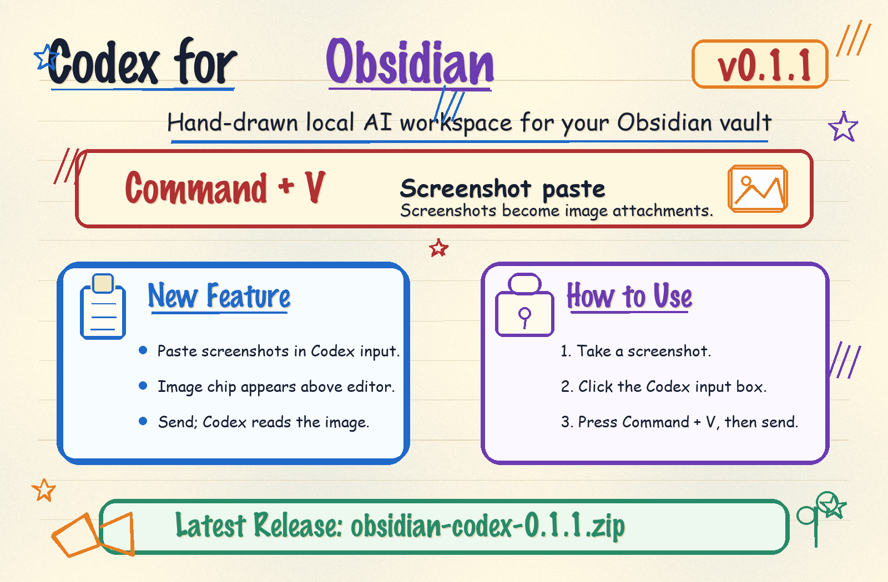

<a href="https://github.com/AKin-lvyifang/obsidian-codex">
  
</a>

<p align="center">
  <a href="#功能特性">功能特性</a> ·
  <a href="#更新说明">更新说明</a> ·
  <a href="#安装">安装</a> ·
  <a href="#快速开始">快速开始</a> ·
  <a href="#截图">截图</a> ·
  <a href="#本地开发">本地开发</a> ·
  <a href="#许可证">许可证</a> ·
  <a href="README.md">English</a>
</p>

<p align="center">
  <a href="https://github.com/AKin-lvyifang/obsidian-codex/releases/latest">
    
    
    
    
  </a>
</p>

<p align="center">
  <a href="https://github.com/AKin-lvyifang/obsidian-codex/releases/download/v0.1.1/obsidian-codex-0.1.1.zip"><strong>下载 v0.1.1</strong></a>
  ·
  <a href="https://github.com/AKin-lvyifang/obsidian-codex/releases/latest">最新 Release</a>
</p>

---

<a id="功能特性"></a>
## 功能特性

### Vault 原生 Codex 工作区

- 在 Obsidian 侧栏中打开 Codex。
- 直接以当前 vault 为工作区。
- 让 Codex 读取笔记、查看文件夹、修改文档、执行本地命令。
- 不需要在 Obsidian 和外部聊天窗口之间来回切换。

### Agent 式过程时间线

- 将思考、命令、文件编辑、MCP 调用和上下文用量渲染成可读过程卡片。
- 被处理的文件会显示为文件 chip，vault 内文件可回到 Obsidian 打开。
- 大输出和原始详情默认折叠，避免对话被日志淹没。
- 支持 Agent / Plan 模式、模型选择、思考强度、速度和文件权限模式。

### 本地优先集成

- 复用本机 Codex CLI 登录状态。
- 默认不要求保存 OpenAI API key。
- 可选配置 OpenAI Responses API 兼容的自定义 Provider，并为同一个 Provider 保存多个模型。
- 支持为插件启动的 Codex 子进程配置本地代理。
- 插件、MCP、Skills 开关只作用于当前 vault，不改 Codex 全局配置。

<a id="更新说明"></a>
## 更新说明

### v0.1.1

- 支持在 Codex 输入框里用 `Command+V` 直接粘贴微信截图或系统截图。
- 剪贴板图片会保存到插件内部目录，并作为图片附件发送给 Codex。

### main 分支更新

- 新增 `API Provider` 设置页，可在 Codex 登录态和自定义 API Provider 之间切换。
- 一个 Provider 可填写多个模型，侧栏模型菜单会按配置提供选择。
- API key 只传给插件启动的 Codex 子进程，不写入 Codex 全局配置。

<a id="安装"></a>
## 安装

1. 先安装并登录 Codex CLI。
2. 在 [最新 Release](https://github.com/AKin-lvyifang/obsidian-codex/releases/latest) 下载 [`obsidian-codex-0.1.1.zip`](https://github.com/AKin-lvyifang/obsidian-codex/releases/download/v0.1.1/obsidian-codex-0.1.1.zip)。
3. 解压后得到 `obsidian-codex` 文件夹。
4. 放到你的 vault 插件目录：

```text
<vault>/.obsidian/plugins/obsidian-codex/
```

5. 重启 Obsidian，在第三方插件里启用 `Codex for Obsidian`。

插件文件夹里应包含：

```text
obsidian-codex/
  main.js
  manifest.json
  styles.css
```

<a id="快速开始"></a>
## 快速开始

1. 从 Ribbon 图标或命令面板打开 Codex 侧栏。
2. 让 Codex 检查、总结、改写或管理当前 vault 里的文件。
3. 需要时附加笔记、文件、图片、skills 或 MCP 工具。
4. 通过过程卡片查看命令、编辑、上下文用量和结果证据。

<a id="截图"></a>
## 截图


<a id="本地开发"></a>
## 本地开发

```bash
npm install
npm run test
npm run typecheck
npm run build
```

生成可分享安装包：

```bash
npm run package
```

部署到自己的 Obsidian vault：

```bash
OBSIDIAN_VAULT=/path/to/your/vault npm run deploy
```

<a id="许可证"></a>
## 许可证

Codex for Obsidian 使用 [MIT License](LICENSE) 开源。

在保留版权声明和许可证声明的前提下，你可以按照 MIT License 允许的范围使用、复制、修改、合并、发布、分发、再授权或销售本软件。本软件按“现状”提供，不提供任何形式的担保。
