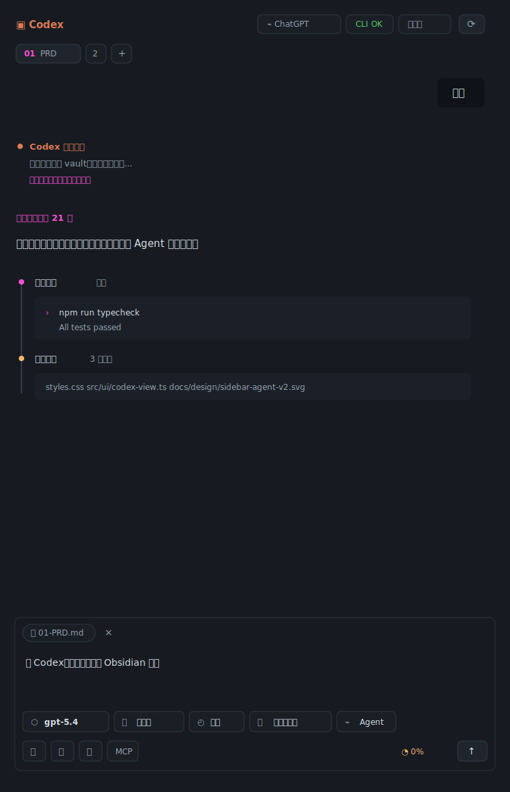

# Codex 侧栏 Agent v2 设计稿

## 目标

- 像 Codex 桌面端嵌入 Obsidian：过程透明、文本可读、工具状态清楚。
- 保持 Obsidian 原生感：只使用 Obsidian CSS 变量，不强行引入独立主题。
- 借鉴 21st-dev agent/chat/input-bar：消息列表 + 底部输入组，输入组内部承载附件、参数、操作。
- 借鉴 shadcn：8px 圆角、细边框、ghost/outline 按钮、Badge 式状态，不用厚重卡片。

## 结构

1. Header
   - 左侧：Codex icon + 标题。
   - 右侧：账号状态、CLI 状态、部署状态、刷新按钮。
   - 状态短标签显示，完整信息放 tooltip。

2. Session strip
   - 小型 tabs，不用大按钮。
   - 当前会话高亮，新建为 ghost icon。

3. ai-chat
   - 用户消息：右侧小气泡。
   - 助手消息：左侧全宽正文，不包大卡片。
   - 思考中：一行呼吸态，点和文字一起轻微脉冲。
   - 思考完成：显示 `完成，思考了 N 秒`。
   - 工具 / 命令 / 编辑记录：时间线式 action block，左侧细线，summary 可折叠。
   - 长输出、代码、diff 均在 block 内滚动，不撑破侧栏。

4. input-bar
   - 顶部：文件 / 图片 / skill chips。
   - 中部：textarea。
   - 底部第一行：模型、思考强度、速度、权限、Agent/Plan。
   - 底部第二行：当前笔记、添加文件、图片、MCP、上下文、发送/停止。
   - 关键修复：操作 icon 单独一行，永远不被 select 遮盖。

## 设计图

